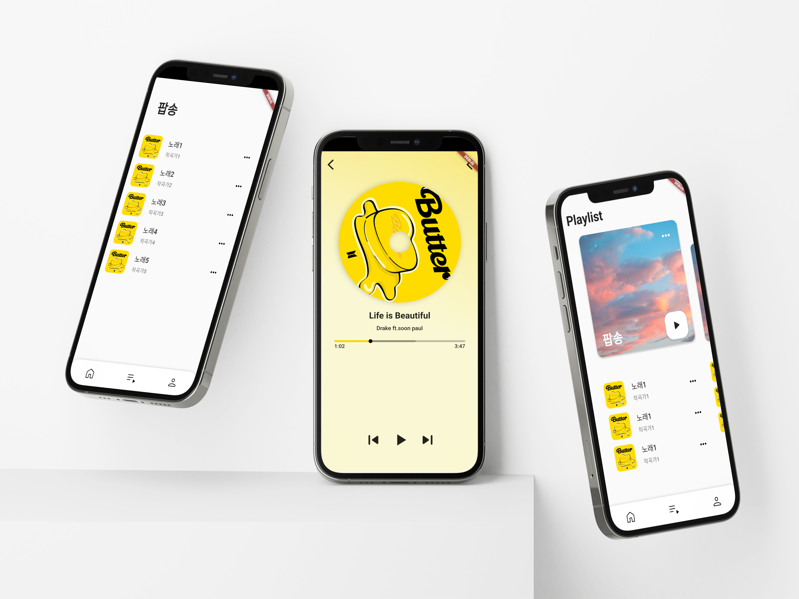

# 부기뮤직

> 2023.10 ~ 2023.11 , 2024.04 ~ 2024.05
>
> 팀프로젝트

## 🛠 Skills

- Mobile Application : Flutter, Dart 
- Backand : TypeScript, NodeJs, NestJS
- DB, Service : MySQL ,DockerJmeter
- 

## 🚗 프로젝트 개요

> 🎵 음악 스트리밍 서비스 가정하고 제작한 애플리케이션 및 서버 토이프로젝트 입니다.

## 🎶 서비스 내용

- 서버
  - 뮤직 서비스의 Rest API 서버
  - JWT을 이용한 Aceess 토큰과 Refresh 토큰 기반 로그인
- 애플리케이션
  - API 서버와 연결
  - 회원가입 및 로그인
  - 음원 검색
  - 인기차트
  - 재생목록 및 현재 재생목록 추가, 삭제

## 🚗 시연

## 💻 담당 개발 내용

- ERD 설계
- 서버 : JWT 인증, 음원 관리, 플레이리스트
- 클라이언트 모바일 애플리케이션

## 🛠️ 트러블 슈팅

### 서버

- **NowPlaysService.create의 동시성 문제**
  - **상황** : 현재 사용자의 플레이리스트에 음악을 추가하는 과정에서, 플레이리스트의 마지막 번호를 비동기로 가져오고 이후 Music의 유효성을 확인하여 추가하는 방식 때문에 동시성 문제가 발생할 수 있었습니다.
  - **해결** : 일련의 과정을 트랜잭션으로 처리하도록 구성하였습니다.
  - **효과** : 동시성 문제가 발생할 확률을 제거하였습니다.
- 다른 유저의 데이터에 접근 할 수 있는 문제
  - **문제상황** : 플레이리스트 등을 가져올 때 id를 임의로 입력하면 다른 유저의 플레이리스트를 가져 올 수 있는 문제가 발생하였습니다.
  - **해결** : 요청한 유저와 가져오는 플레이리스트 소유자가 같은지 검사하는 로직을 추가하고 다른 필요한 모든 서비스에도 비슷한 로직을 추가하였습니다.
  - **효과** : 임의로 다른 유저의 정보를 가져 올 수 없게 되었습니다.

### 클라이언트

- **API 요청시 마다 JWT 인증 확인 필요 및 인증 확인 코드의 반복**

  - **문제상황**  :  클라이언트가 현재 인증 상태를 알 수 없어 서버 API에 요청시 마다 현재 인증 상태를 확인하는 요청을 보내야 하는 요청 낭비가 있음. 또한 해당 로직을 모든 호출에 반복해서 추가해 주어야 하는 번거로움이 있었습니다.

  - **해결 방안** : API  응답의 오류 코드에 따라서 자동으로 Refresh를 요청하고 다시 요청을 보내는 파이프라인을 구축하였습니다.

  - **효과**

    - API 요청시 인증 상태 확인에 따라 재요청을 해야하는 기존의 **10**줄 가량의 코드를 **2**줄의 코드로 모든 곳에서 사용 할 수 있게 됨으로서 코드를 단순화 할 수 있게되었습니다.
    - 매 요청마다 인증 상태를 확인하는 경우에 비해 요청 수가 2배 감소하였습니다.

  - **소스코드 링크**

    https://github.com/JioBani/BoogieMusicApp/blob/f486f2e6f125fae410b46491184d7a3110d7a41a/lib/Service/LoginService.dart#L33

- **로딩 다이얼로그 제작**

  - **문제상황**  : 네트워크 요청 등의 비동기 함수의 실행 후 결과를 반환하며 자동으로 닫히는 다이얼로그가 반복적으로 필요하게 되었습니다.

  - **해결** : 비동기 함수를 실행하고 그 값을 반환하는 동안 실행되는 로딩 다이얼로그를 제작하였습니다.

  - **소스코드 링크**

    https://github.com/JioBani/BoogieMusicApp/blob/f486f2e6f125fae410b46491184d7a3110d7a41a/lib/Common/LoadingDialog.dart#L7

## 🌱 의의 및 느낀 점

### 팀장을 맡아 프로젝트를 성공적으로 이끈 경험

본 프로젝트는 제가 팀장 역할을 맡았던 대학 전공 수업의 팀프로젝트 입니다. 팀장으로서 팀원들이 하고 싶어 하는 말을 최대한 캐치 하여 그것이 프로젝트에 반영되지는 않더라도 팀원의 이견을 모두 청취 할 수 있도록 유도하였습니다. 이를 통해 공격적이지 않으면서도 효과적인 피드백이 활발하게 이루어질 수 있었습니다. 그 결과, 교수님께 '가장 완벽한 팀'이라는 칭찬을 받았으며, A+라는 높은 성적을 받을 수 있었습니다.

### Nest.js 프레임워크 경험 및 아키텍처 학습

Nest.js 프레임워크를 이용하여 서버를 구성하면서, 모듈, Controller, Service 등 체계화 된 아키텍쳐를 이용하여 서버를 구현하는 경험을 하게 되었습니다. 본 프로젝트를 진행하면서 Nest.js의 아키텍처에 인상을 받아 [**다른 프로젝트**](https://slime-radium-f3d.notion.site/b5c4711192014994a699981d216eadb4?pvs=4)의 서버를 구성 할 때 비슷한 방식의 아키텍처를 스스로 구성하였습니다.

