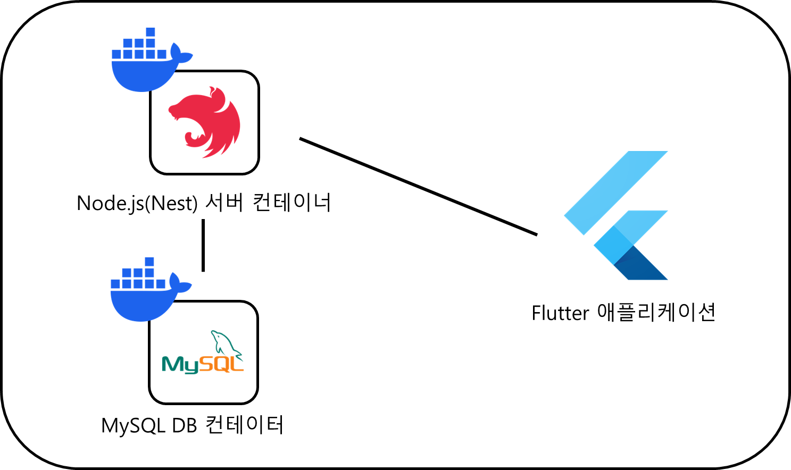

# 부기뮤직

> 2023.10 ~ 2023.11 , 2024.04 ~ 2024.05
>
> 팀프로젝트

## 🛠 Skills

- Mobile Application : Flutter, Dart 
- Backand : TypeScript, NodeJs, NestJS
- DB, Service : MySQL ,DockerJmeter
- 

## 🚗 프로젝트 개요

> 🎵 Nest.js 와 Flutter를 사용한 음원검색 , 플레이리스트 기능이 있는 음악 스트리밍 서비스 입니다.

## 맡은 역할

- ERD 설계
- 클라이언트 애플리케이션 - Flutter
- 음악 서비스 서버 - Nest.js
  - 인증, 음원 관리, 플레이리스트

## 💡 기능

- 서버
  - 뮤직 서비스의 Rest API 서버
  - JWT을 이용한 Aceess 토큰과 Refresh 토큰 기반 로그인
- 애플리케이션
  - API 서버와 연결
  - 회원가입 및 로그인
  - 음원 검색
  - 인기차트
  - 재생목록 및 현재 재생목록 추가, 삭제

## ⚙ 시스템 구성도

## 트러블 슈팅

- 서버
  - Music의 정보를 가져올 때 반복적으로 다른 연관관계에 있는 엔티티에 접근해야 하는 문제(N+1과 비슷)
    - **문제상황** : 애플리케이션 내에서 Music을 사용할때 연결된 Album과 Artist에 속한 Muisc을 사용하는 경우가 대다수 이기 때문에 서버에 요청을 반복적으로 보내게 됨
    - **해결** : DTO를 제작하고 join쿼리를 통해서 필요한 정보를 한번에 가져오도록 함
    - **효과 :**
  - NowPlaysService.create의 동시성 문제
    - **문제상황** : 현재 사용자의 플레이리스트에 음악을 추가하는 과정에서, 플레이리스트의 마지막 번호를 비동기로 가져오고 이후 Music의 유효성을 확인하여 추가하는 방식 때문에 동시성 문제가 발생할 수 있음
    - **해결** : 일련의 과정을 트랜잭션으로 처리
    - **효과** : 동시성 문제가 발생할 확률을 없앰
  - Response 에러의 내용을 정확히 전달 할 수 없는 문제
    - **문제상황**
      - UnauthorizedException이 발생했을때, 클라이언트 측에서는 Access 토큰이 올바르지 않은것인지, 유효기간이 만료된 것인지 알 수 없음
      - 회원가입시에도 아이디 중복등의 불가 이유를 클라이언트측에 구체적으로 알릴 필요가 있음
    - **해결 :** 커스텀 Exception 과 ErrorDto , GlobalExceptionFilter를 활용하여 클라이언트 측에 status코드 외에도 구체적인 오류 이유를 알리도록 함.
    - **효과 :** 클라이언트 측에서 에러 메세지를 해석해서 Refresh Token을 다시 요청할 것인지, 로그인을 다시 진행할 것인지 등의 효율적인 개발을 할 수 있게 됨
  - 다른 유저의 데이터에 접근 할 수 있는 문제
    - **문제상황** : 플레이리스트 등을 가져올 때 id를 임의로 입력하면 다른 유저의 플레이리스트를 가져 올 수 있음
    - **해결** : 요청한 유저와 가져오는 플레이리스트 소유자가 같은지 검사하는 로직을 추가하고 다른 필요한 모든 서비스에도 비슷한 로직을 추가함
    - **효과** : 임의로 다른 유저의 정보를 가져 올 수 없게됨

- 애플리케이션(클라이언트)
  - API 요청시 마다 JWT 인증 확인 필요 및 인증 확인 코드의 반복
    - **문제상황**  :  클라이언트가 현재 인증 상태를 알 수 없어 서버 API에 요청시 마다 현재 인증 상태를 확인하는 요청을 보내야 하는 요청 낭비가 있음. 또한 해당 로직을 모든 호출에 반복해서 추가해 주어야 하는 번거로움이 있음
    - **해결 방안** : API  응답의 오류 코드에 따라서 자동으로 Refresh를 요청하고 다시 요청을 보내는 파이프라인 구축

    - **효과**
      - API 요청시 인증 상태 확인에 따라 재요청을 해야하는 기존의 **10**줄 가량의 코드를 **2**줄의 코드로 모든 곳에서 사용 할 수 있게 됨으로서 생산력 증가
      - 매 요청마다 인증 상태를 확인하는 경우에 비해 요청 수가 2배 감소
  - 로딩 다이얼로그의 필요성
    - **문제상황**  : 네트워크 요청 등의 비동기 함수의 실행 후 결과를 반환하며 자동으로 닫히는 다이얼로그가 반복적으로 필요함.
    - **해결** : 로딩 다이얼로그 위젯을 제작
      - 기능
        - 비동기 함수를 실행하고 그 값을 반환
        - 현재 컨텍스트를 확인하여 다이얼로그를 pop(위젯트리의 변화에 대응)

## 🚗 시연

<video src="README.assets/play.gif"></video>
